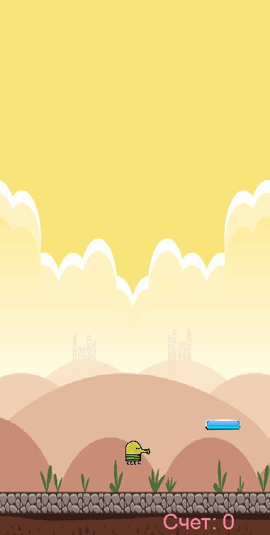
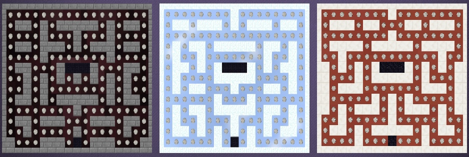
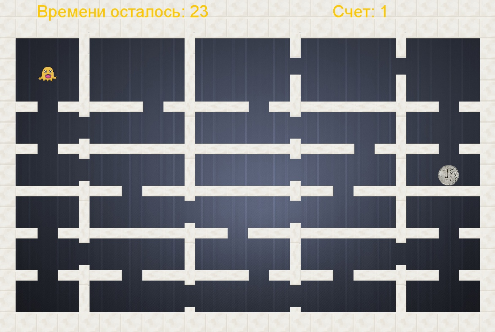

# **Java Games**
 
This repository is about games on Java. 
Here is a list of them:
- #### *Doodle*
- #### *Car Crash*
- #### *Dino*
- #### *Packman*
- #### *Maze*

## Doodle 
Casual Doodle game. 
Your hero automatically jumps from platform to platform 
to go higher - you control whether he jumps right or left. 
Platforms do not move. They are not evenly spaced, 
so you must move the Doodler by pressing A or D to the left or right respectively
as he jumps. If you miss a platform and there would not be platform below to land on, 
you will go into free fall, and the game would be over. 
If you move Doodler far enough to one side,
the Doodler will leave the screen and appear on the other side

 

## Car Crash 
In this game you have to avoid collision with other cars. Each white car has its own speed and direction. 
You are controlling the red car only.  
##### Buttons to control:
- **W** - to move your car straight
- **A** - to move your car to the left
- **S** - to move your car back
- **D** - to move your car to the right

If you crash into a white car, 
you will get the number of points scored on the screen, and the game will be over.

## Dino 
Dino is an infinity game, where you should jump over cacti.  
Cacti appears in groups of 1-3 units with unique height;

Press **SPACE** to jump. If you bump into cactus, a score will be shown, and the game ends

## Packman 
Packman is 2D game, where you have to collect all the coins on a map while avoiding monsters. 
The game offers you 3 levels with unique design and level-design.

Each level has 3 monsters which moves in a straight line. When they come to crossroad,
they move in a random direction. 
##### Buttons to control:
- **W** - to move straight
- **A** - to move left
- **S** - to move back
- **D** - to move right

If you are caught by a monster, you will lose 25 coins. 
So if you have less than 25 coins, and the monster catch you, the game would be over

## Time Maze 
Here you need to collect as many coins as possible while the timer is running. 
At the start, the timer counts down for 30 seconds. Each coin increases this time value by 15.

##### Buttons to control:
- **W** - to move straight
- **A** - to move left
- **S** - to move back
- **D** - to move right

When the timer runs out, the game is over.

